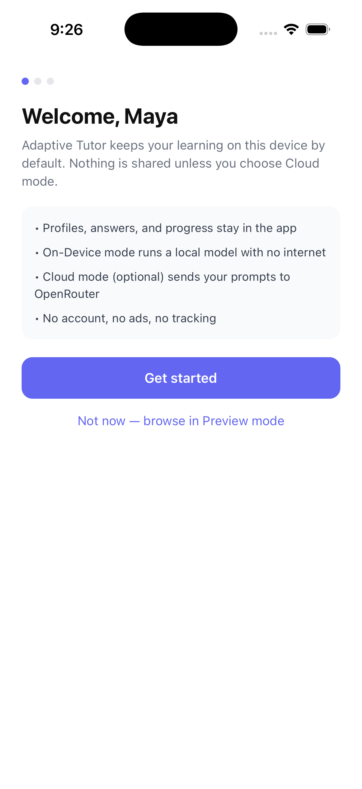
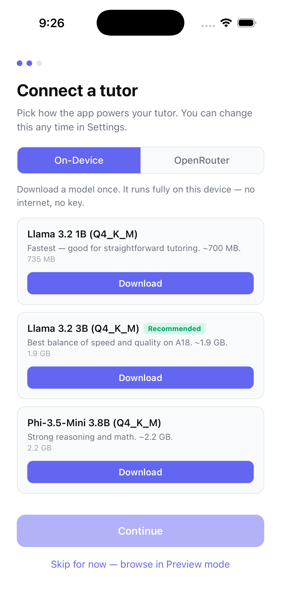
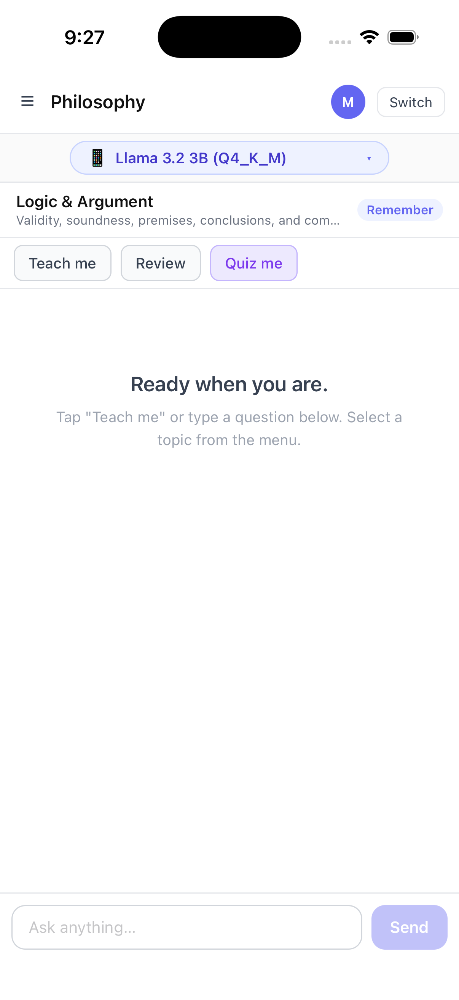
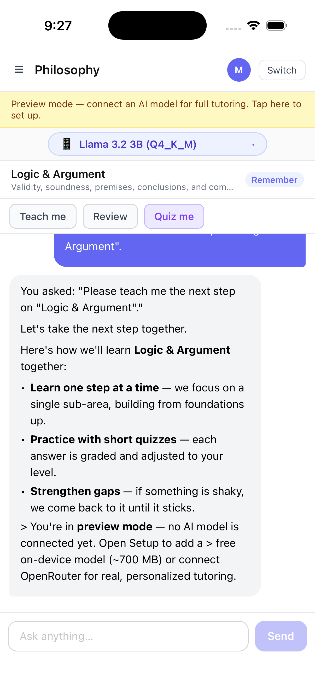
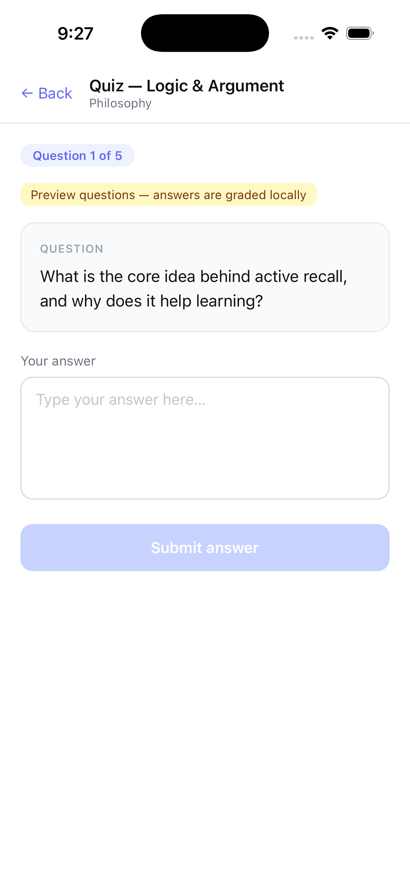
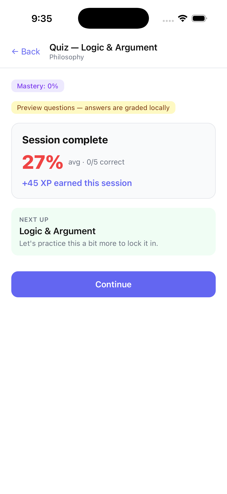
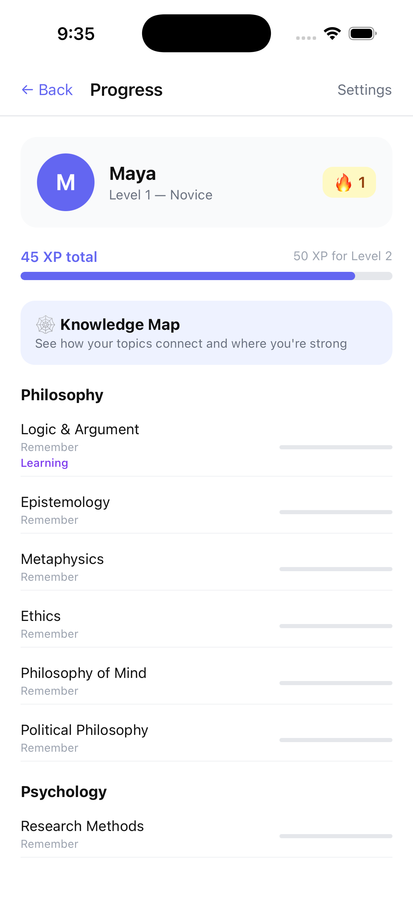
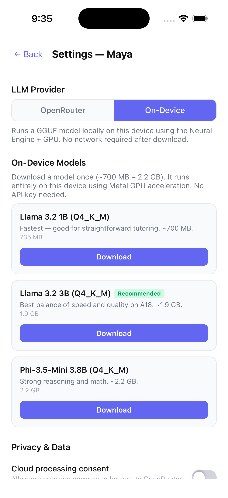
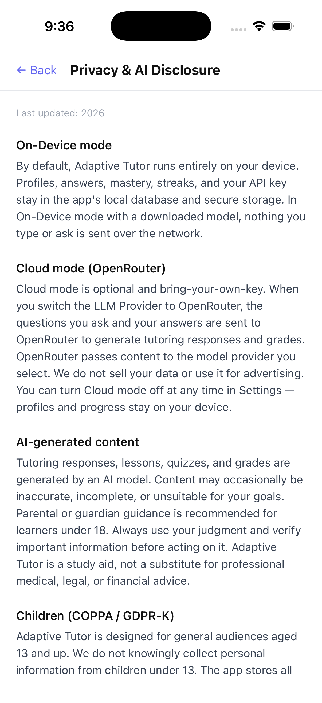
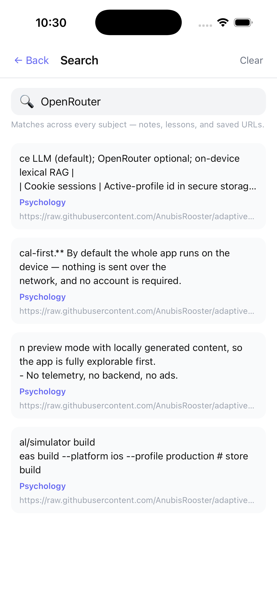

# Adaptive Tutor — iOS

A native iOS app that teaches, quizzes, detects knowledge gaps, and coaches across multiple
subjects — adapting to each learner's mastery (ZPD) and Bloom's-taxonomy level.

Built with **Expo / React Native** as a modern, local-first rewrite of the
[Adaptive Tutor Agent](https://github.com/AnubisRooster/adaptive-tutor-agent) web prototype.

## Screenshots

| | |
| --- | --- |
|  |  |
|  |  |
|  |  |
|  |  |
|  |  |
|  |  |
|  |  |

Captured on the iOS Simulator (iPhone, iOS 26).

## Architecture

**Local-first.** By default the whole app runs on the device — nothing is sent over the
network, and no account is required.

- **On the device:** the SQLite database (`expo-sqlite` + Drizzle ORM), the adaptive
  engine, RAG retrieval, curriculum/quiz generation, and URL content ingestion.
- **The LLM — two modes:**
  - **On-Device (default):** a GGUF model (Llama 3.2 1B/3B or Phi-3.5) downloaded once and
    run locally via `llama.rn` (Metal GPU + Neural Engine). Fully offline after download.
  - **Cloud (optional, bring-your-own-key):** **OpenRouter**, using *your own* API key
    stored in the iOS Keychain via `expo-secure-store`. Requires explicit consent per profile.
- **Preview mode:** without a downloaded model or an OpenRouter key, lessons and quizzes run
  in preview mode with locally generated content, so the app is fully explorable first.
- No telemetry, no backend, no ads.

### Why these choices

| Web original | iOS port |
| --- | --- |
| Next.js Node server + `app/api/*` routes | No server — logic runs locally, called directly from screens |
| `better-sqlite3` (native binary) | `expo-sqlite` + `drizzle-orm/expo-sqlite` |
| Ollama daemon (chat + embeddings) | `llama.rn` on-device LLM (default); OpenRouter optional; on-device lexical RAG |
| Cookie sessions | Active-profile id in secure storage |

> Embeddings: OpenRouter has no embeddings endpoint and processing stays local, so v1 uses
> **lexical (keyword/BM25) retrieval** over ingested content rather than vector similarity.
> On-device neural embeddings are a future enhancement.

### Privacy & App Store readiness

- **Privacy manifest** (`PrivacyInfo.xcprivacy`, generated from `app.json`) declares only
  required reasons: `CA92.1` (UserDefaults), `C617.1` (file timestamps), `35F9.1`
  (device boot time); `ITSAppUsesNonExemptEncryption` is `false`.
- On-device mode has no outbound network traffic. Cloud mode is consent-gated and covered
  in the in-app **Privacy & AI disclosure** (`/privacy`), which also covers AI-disclosure,
  COPPA/GDPR-K (13+ general audience), and local data deletion.

## Project layout

```
app/        Expo Router screens (file-based routing)
lib/        Ported domain logic (adaptive engine, prompts, schemas, RAG, generators, setup, preview)
db/         Drizzle schema + first-run curriculum seeder
__tests__/  Jest test suites
```

## Development

```bash
npm install        # uses legacy-peer-deps (see .npmrc) for RN 19 peer churn
npm start          # Expo dev server (open in Expo Go or a dev build)
npm run ios        # iOS simulator (requires macOS)

npm run typecheck  # tsc --noEmit
npm run lint       # eslint
npm test           # jest
```

CI (`.github/workflows/ci.yml`) runs typecheck + lint + test on every push/PR to `main` —
273 tests, 31 suites, all passing.

## Build & release

EAS Build (cloud) produces iOS builds without a local Mac; see `eas.json`. A physical iPhone
or the iOS Simulator (macOS) is needed to run device builds.

```bash
eas build --platform ios --profile preview      # internal/simulator build
eas build --platform ios --profile production    # store build
eas submit --platform ios
```

## Roadmap

- **Phase 0 — Foundations** ✅ Expo + Router scaffold, jest-expo, ESLint/Prettier, CI, EAS config.
- **Phase 1 — Domain core** ✅ Pure-TS logic ported + tested; on-device SQLite + curriculum seeder.
- **Phase 2 — LLM integration** ✅ On-device `llama.rn` models (default) + optional OpenRouter with secure key storage.
- **Phase 3 — Core learner UI** ✅ Profiles, Learn, Settings screens; markdown + math rendering.
- **Phase 4 — Quizzes & mastery** ✅ Quiz flow, adaptive grading, Bloom progression, gamification (XP, streaks).
- **Phase 5 — URL ingestion** ✅ Add material by URL; on-device lexical retrieval grounds answers.
- **Phase 6 — Polish & submission** ✅ Local-first onboarding, preview mode, privacy disclosure + manifest, encryption
  exemption, screenshots. Remaining: App Store listing metadata + review notes.